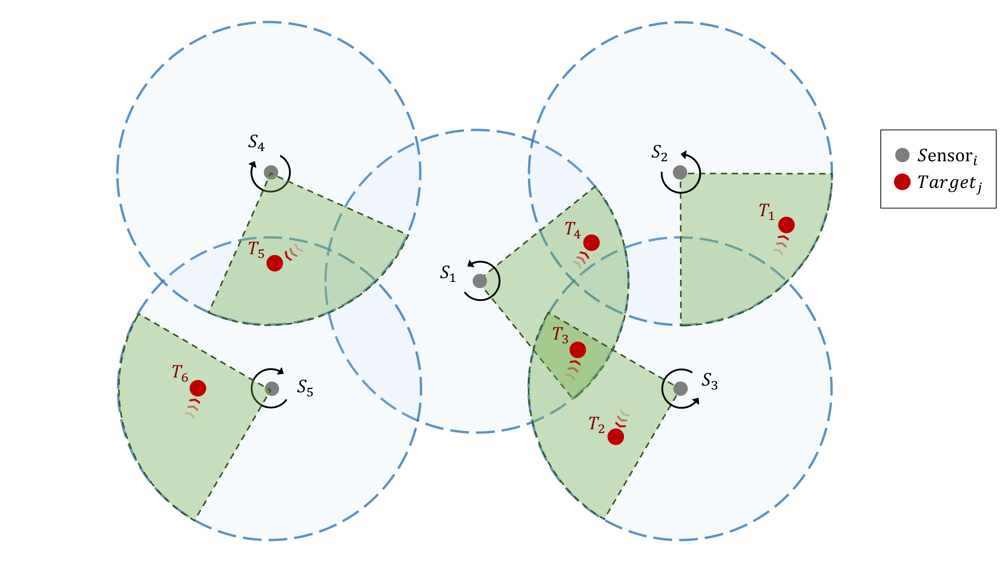

# Target Coverage Problem in Directional Sensor Networks

This repository is a pure environment of DSNs, which is used in the paper [Learning Multi-Agent Coordination for Enhancing Target Coverage in Directional Sensor Networks](https://arxiv.org/abs/2030.12345). 


>📋  The target coverage problem is a multi-agent cooperation problem, where the smart sensors can rotate to cover the targets. Their coverage range is limited in angle and distance, so the aim is to cover as many targets as possible by the cooperation among the smart sensors.

## Requirements

To install requirements:

```setup
pip install -r requirements.txt
```

## Random agent
We provide an agent with random policy that takes random action in every time step to show how to use this environment.
To start the environment and visualize, run this command:

```train
python random_agent.py --render
```

## Contributing
If you found this work useful, please consider citing:
>📋  Pick a licence and describe how to contribute to your code repository. 
